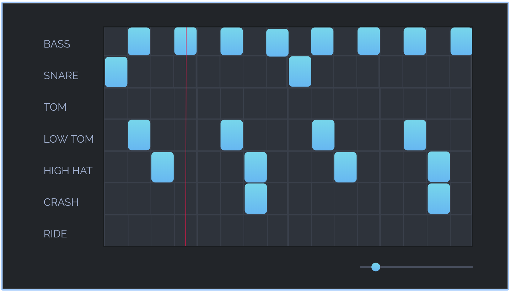

Music Sequencer

## Scope

Create an application -- 

## MVP

1. As a user, I want to be able to login, so that I can access my existing beats.

2. As a user, I want to be able to create beats for various drum sounds.

3. As a user, I want to be able to increase or decrease the beats per minute at which my music sequence plays. 

### Additonal Functionality

4. As a user, I want to be able to delete existing beats. 

5. As a user, I want to be able to share my beats with others. 

## Deliverables

### Day 1

1. Elect a team lead. 
2. Pick a name for your application.
3. If you'd like to create a custom design, you have 24 hours to turn in original design documents for approval. They must be approved by the entire instructional staff. 
4. A repository with all teammates as contributers. 
5. A heroku deployment.
6. Divy up user stories.
7. Create and assign issues. 
8. Create a Kanban board. 
9. Write all tests.

### Day 2

All API tests must pass. 
A rough UI should be in place. 

### Day 6

1. A deployed fully functional application with all MVP points accomplished and design files matched. 